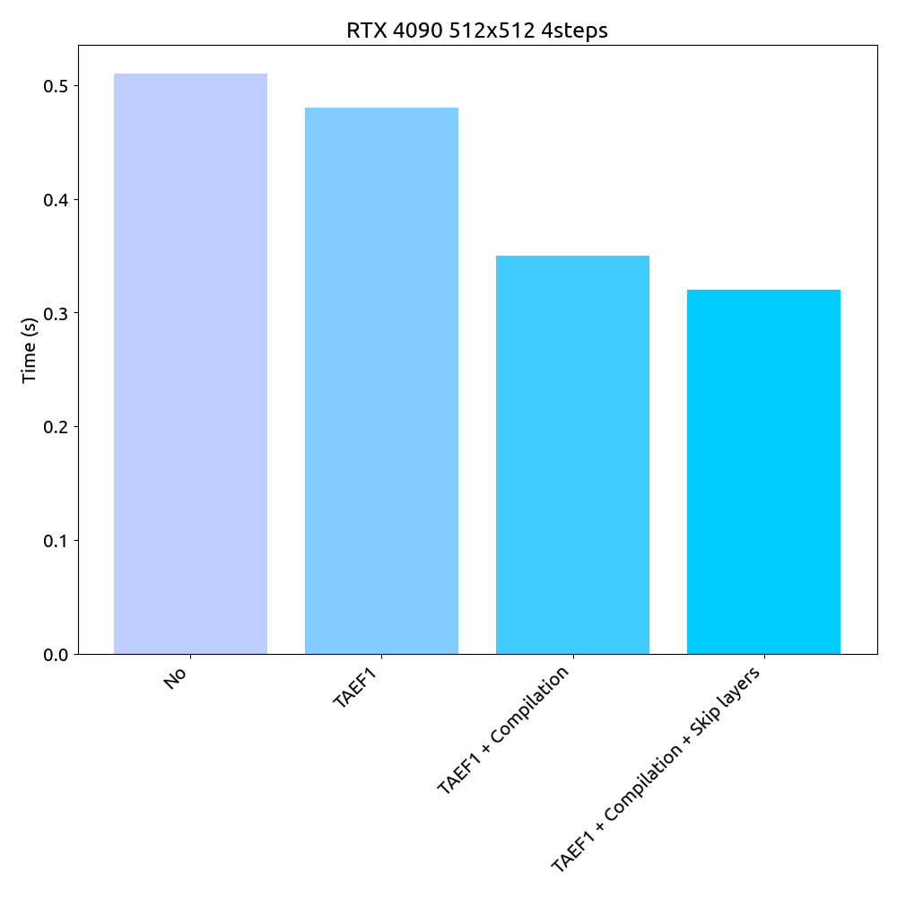
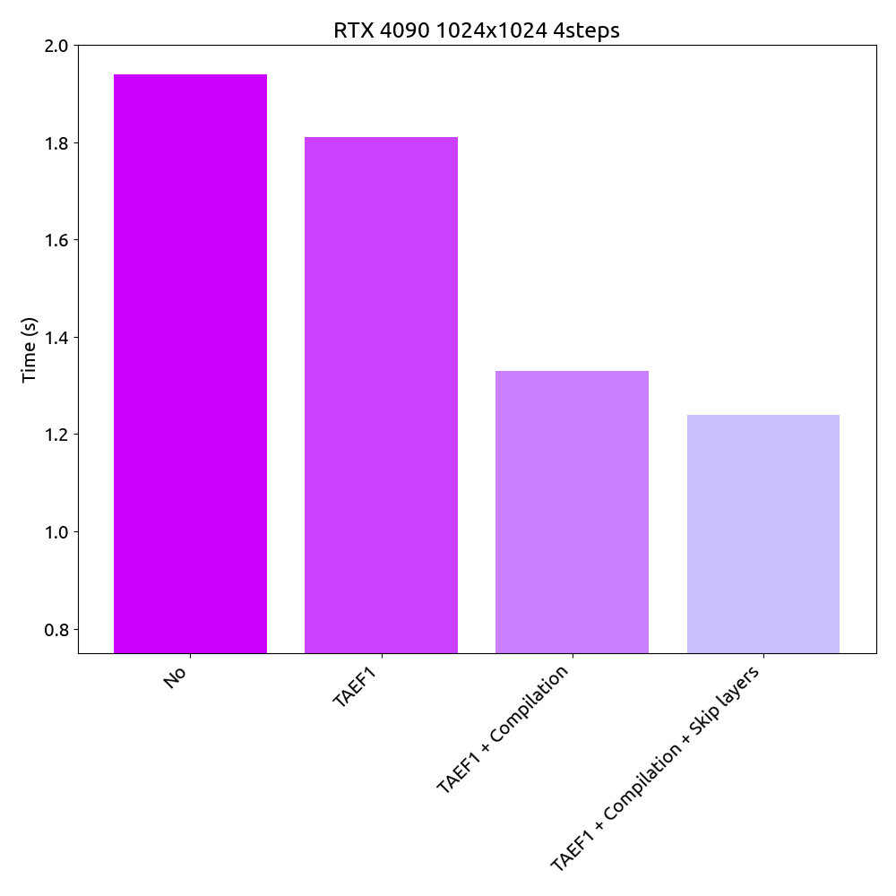
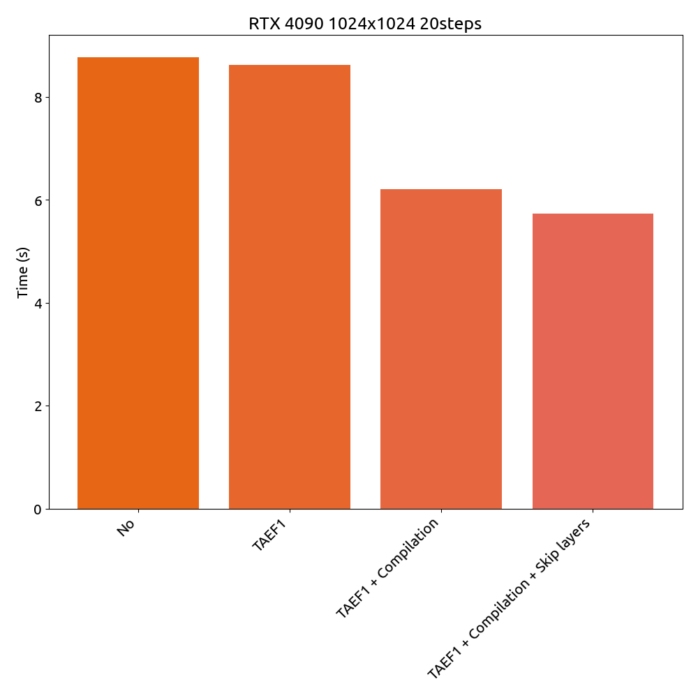

# 🍭 ComfyUI Flux Accelerator

> **Note**
> 日本語のREADMEは[こちら](./README_ja.md)です。

ComfyUI Flux Accelerator is a custom node for [ComfyUI](https://github.com/comfyanonymous/ComfyUI]) that accelerates Flux.1 image generation, just by using this node.

<p align="center">
  
</p>

## How does ComfyUI Flux Accelerator work?

ComfyUI Flux Accelerator accelerates the generation of images by:

1. **Using [TAEF1](https://github.com/madebyollin/taesd).**

    TAEF1 is a fast and efficient AutoEncoder that can encode and decode pixels in a very short time, in exchange for a little bit of quality.

2. **Quantization and Compilation.**

    ComfyUI Flux Accelerator utilizes [`torchao`](https://github.com/pytorch/ao) and [`torch.compile()`](https://pytorch.org/docs/stable/generated/torch.compile.html) to optimize the model and make it faster.

3. **Skipping redundant DiT blocks.**

    ComfyUI Flux Accelerator offers an option to skip redundant DiT blocks, which directly affects the speed of the generation.

    You can choose the number of blocks to skip in the node (default is 3, 6, 8, 12 of MMDiT blocks).

## How much faster is ComfyUI Flux Accelerator?

ComfyUI Flux Accelerator can generate images up to **_37.25%_** faster than the default settings.

Here are some examples (tested on RTX 4090):

#### 512x512 4steps: 0.51s → 0.32s (37.25% faster)

<p align="center">
  
</p>

#### 1024x1024 4steps: 1.94s → 1.24s (36.08% faster)

<p align="center">
  
</p>

#### 1024x1024 20steps: 8.77s → 5.74s (34.55% faster)

<p align="center">
  
</p>

## How to install ComfyUI Flux Accelerator?

1. **Clone this repository and place it in the `custom_nodes` folder of ComfyUI**

    ```bash
    git clone https://github.com/discus0434/comfyui-flux-accelerator.git
    mv comfyui-flux-accelerator custom_nodes/
    ```

2. **Install PyTorch and xFormers**

    ```bash
    ## Copied and modified https://github.com/facebookresearch/xformers/blob/main/README.md

    # cuda 11.8 version
    pip3 install -U torch torchvision torchao triton xformers --index-url https://download.pytorch.org/whl/cu118
    # cuda 12.1 version
    pip3 install -U torch torchvision torchao triton xformers --index-url https://download.pytorch.org/whl/cu121
    # cuda 12.4 version
    pip3 install -U torch torchvision torchao triton xformers --index-url https://download.pytorch.org/whl/cu124
    ```

3. **Download [TAEF1](https://github.com/madebyollin/taesd) with the following command**

    ```bash
    cd custom_nodes/comfyui-flux-accelerator
    chmod +x scripts/download_taef1.sh
    ./scripts/download_taef1.sh
    ```

4. **Launch ComfyUI**

    _Launch command may vary depending on your environment._

    **a. If you have H100, L40 or more newer GPU**

    ```bash
    python main.py --fast --highvram --disable-cuda-malloc
    ```

    **b. If you have RTX 4090**

    ```bash
    python main.py --fast --highvram
    ```

    **c. Otherwise**

    ```bash
    python main.py
    ```

5. **Load [the workflow](./workflow/flux-accelerator-workflow.json) in the `workflow` folder**

      _You can load the workflow by clicking the `Load` button in the ComfyUI._

6. **Enjoy!**

## How to use ComfyUI Flux Accelerator?

Just use the `FluxAccelerator` node in the workflow, and you're good to go!

_**If your GPU has less than 24GB VRAM, you may encounter frequent Out Of Memory errors when changing parameters. But simply ignore them and run again and it will work!**_

## What are the limitations of ComfyUI Flux Accelerator?

ComfyUI Flux Accelerator has the following limitations:

1. **Image Quality**

    ComfyUI Flux Accelerator sacrifices _a little bit_ of quality for speed by using TAEF1 and skipping redundant DiT layers. If you need high-quality images, you may want to use the default settings.

2. **Compilation Time**

    ComfyUI Flux Accelerator may take _30-60 seconds_ to compile the model for the first time. This is because it uses `torch.compile()` to optimize the model.

3. **Compatibility**

    ComfyUI Flux Accelerator is now only compatible with Linux.

## License

ComfyUI Flux Accelerator is licensed under the MIT License. See [LICENSE](./LICENSE) for more information.
